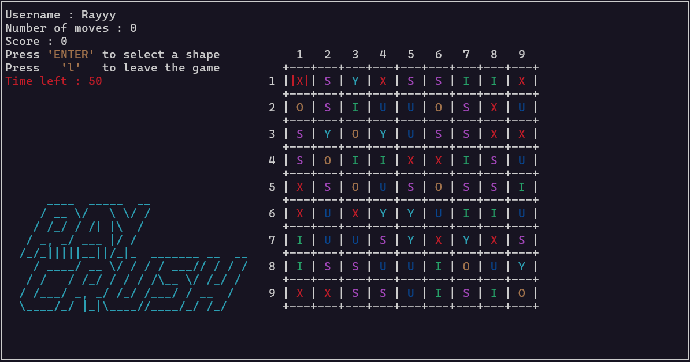

<h1 align="center">🕸 Ray Crush 🕸</h1>



## Introduction

**Ray Crush** is a game I created in C using the `ncurses` library during my first year of preparatory engineering studies to strengthen my programming skills. Inspired by **Candy Crush**, the game features a grid filled with different shapes that players can swap to create matches. By aligning three or more identical shapes vertically or horizontally, players cause them to disappear in a chain reaction, with new shapes falling to fill the gaps. Each successful match increases the score by the number of shapes disappearing, and the goal is to reach the highest score possible within a 60-second time limit.

## Prerequisites

- **C compiler** such as `gcc` is required to compile the game.
- `ncurses` library to manage the game's terminal-based interface.

## Installation

1. **Install the `ncurses` library with the following command :** 
```sh
sudo apt-get install libncurses5-dev libncursesw5-dev libncurses5 libncursesw5
```

2. **Clone the repository :** 
```sh
git clone https://github.com/RayyyZen/Ray-Crush.git
```

3. **Move into the project folder :** 
```sh
cd RayCrush
```

4. **Compile and run the project :**
```sh
make run
```
- **OR**
```sh
make && ./RayCrush
```

## Game instructions

**Menu options :**
- New game : Start a new game session
- Resume game : Load the last saved game
- Credits
- Exit : Quit the game

**Game controls :**
- `↑` or `z` : Move up
- `←` or `q` : Move left
- `↓` or `s` : Move down
- `→` or `d` : Move right
- `ENTER` : Select a menu option or lock a shape to move

**Gameplay :**

1. Select a shape in the grid by pressing `ENTER`.

2. After selecting, choose a direction (up, left, down, or right) with the corresponding keys to swap the selected shape with an adjacent one.

## License

This project is licensed under the BSD 2-Clause License. See the [LICENSE](LICENSE) file for details.